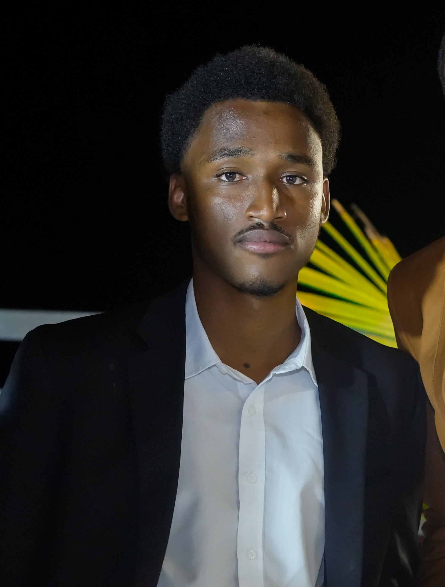

<table>
  <tr>
    <td width="200" valign="top">
      
    </td>
    <td valign="top">

      <h1>SEYDOU DIALLO</h1>

      <strong>Software Developer | AI/NLP Enthusiast | Linux Administrator | Community Builder</strong>

      <ul>
        <li><strong>Address:</strong> Somone, Senegal</li>
        <li><strong>Email:</strong> <a href="mailto:mail.seydou.diallo@gmail.com">mail.seydou.diallo@gmail.com</a></li>
        <li><strong>GitHub:</strong> <a href="https://github.com/sudoping01">sudoping01</a></li>
        <li><strong>HuggingFace:</strong> <a href="https://huggingface.co/sudoping01">sudoping01</a></li>
        <li><strong>LinkedIn:</strong> <a href="https://www.linkedin.com/in/seydou-diallo-08ab311ba/">seydou diallo</a></li>
      </ul>

    </td>
  </tr>
</table>

---

## PROFILE

Passion for transforming real-world challenges into technological solutions. Strong background in software development, with ongoing work in Artificial Intelligence for social impact. Committed to innovation, entrepreneurship, and building communities that use technology for progress and inclusion. Founder of MALIBA-AI and co-founder of DJELIA, initiatives creating AI systems for African languages and real-world accessibility.

---

## EDUCATION

**Dakar American University of Science and Technology** | Dakar, Senegal  
*Computer Science*  | 2024 - Present

**Ecole Normal D'Enseignment Technique et Professional** | Bamako, MALI  
*Electronic Engineering* | 2023 - 2024

**Technical Baccalaureate in Electronic Engineering** | Mali  
*Industrial Sciences and Technologies* | July 2022  
- **First National** in Malian Technical Baccalaureate session
- Specialization: Electronic Engineering

---

## PROFESSIONAL EXPERIENCE

### Co-Founder | [DJELIA](https://djelia.cloud)  
*2024 – Present*  
- Leading the full AI model lifecycle from data collection and preparation to training, evaluation, and deployment.  
- Developing and maintaining production-grade **ASR**, **TTS**, and **MT**, **LLM** models for the Bambara language.  
- Building **developer SDKs and APIs** that allow seamless integration of Djelia’s language technologies into third-party applications.  
- Driving accessibility and innovation by making AI services available to millions of Bambara speakers and local developers.  

### Founder | [MALIBA-AI Community](https://maliba-ai.org)  
*2025 – Present*  
- Leading AI research and development efforts for indigenous Malian languages, from data collection to final model.  
- Developing and maintaining **ASR**, **TTS**,**LLM** and **MT** models for Malian languages.  
- Building **inference SDKs** and **serving servers** to enable developers and communities to easily integrate MALIBA-AI models into their products and solutions.  
- Driving a community-led initiative to democratize AI access across education, healthcare, agriculture, and local businesses.  
- Promoting digital inclusion by creating **speech-first interfaces** for primarily oral languages.  

### Software Developer & AI Engineer | [Caytu Robotics](https://caytu.ai)  
*2024 – Present*  
- Developing and maintaining a scalable **IoT ecosystem** for remote control and real-time video streaming and data monitoring.  
- Building **multi-modal AI applications**, powering **Caytu Avatar**, enabling natural language interaction with any rest api include Caytu IoT Ecosystem.  
- Creating tools and SDKs to allow seamless integration of AI services, automation workflows, and personal assistant features.  

### Robotics Team Member | Malian National Team  
*2021, 2023*
- Represented Mali in international robotics competitions
- Collaborated on complex engineering projects and problem-solving challenges

## RESEARCH PROJECTS

### **Large Language Models**

**MALIBA-LLM** | Lead Developer | MALIBA-AI

* Built **MALIBA-LLM**, a fine-tuned version of google/gemma-3n-E2B-it and the **first open-source Large Language Model for Bambara (Bamanankan)**
* Supports **Bambara ↔ French/English** code-switching for technical terms, instruction following, conversational reasoning, knowledge retrieval, content generation, translation, mathematical reasoning, coding support, logical problem-solving, and Mali-specific knowledge
* Achieved **0.4952 validation loss**, ↓93.4% from initial 7.4595
* Designed for **education, translation, conversational AI, content generation, and accessibility** for 15M+ speakers in West Africa, as part of the MALIBA-AI project
* Model: [maliba-llm](https://huggingface.co/sudoping01/maliba-llm)

### Speech Synthesis 

**Bambara Text-to-Speech** | Lead Developer | MALIBA-AI

- Open-source, high-quality TTS system for Bambara with **4.2/5.0** subjective quality score
- Achieved **4.1/5.0** naturalness ratings with 10 authentic Bambara speakers
- Addresses digital exclusion crisis affecting 15+ million non-literate adults in sub-Saharan Africa
- Released via Hugging Face: [MALIBA-AI/bambara-tts](https://huggingface.co/MALIBA-AI/bambara-tts) 
- **8,712 downloads** on Hugging Face *(all-time, as of October 2025)*

**MALIBA-TTS: Multilingual Speech Synthesis for Malian Languages** | *Lead Contributor*  
- Developed **text-to-speech (TTS) models** for six Malian languages: **Bambara, Boomu, Dogon, Pular, Songhoy, and Tamasheq**  
- Based on **Meta’s MMS-TTS** and **VITS**, optimized for **CPU inference** and **real-time synthesis**  
- Enables **voice interfaces, education, and accessibility tools** across Mali  
- Promotes **language inclusion and digital accessibility** under the *MALIBA-AI* initiative  
- Models: [huggingface.co/MALIBA-AI/malian-tts](https://huggingface.co/MALIBA-AI/malian-tts)

### GAIFE: Generative AI for Education  
*Co-Author | Bill & Melinda Gates Foundation Grand Challenges | RobotsMali*
- Developed methodology using generative AI and automatic translation for children's educational materials
- Produced books and pedagogical content in Bambara, Mali's most widely spoken language
- [Libraire](https://bloomlibrary.org/RobotsMali)
- [paper](https://aclanthology.org/2025.findings-naacl.442/)

### Bayelemabaga: Bambara Machine Translation
*Data Processing | RobotsMali | RIT Partnershis*
- First-ever machine translation model for Bambara-French language pairs
- Involved in data extraction, cleaning, and alignment of parallel corpora
- [Project Details](https://www.rit.edu/lpi/research)
- [Dataset](https://huggingface.co/datasets/RobotsMaliAI/bayelemabaga)

### Automatic Speech Recognition Systems

**Wolof ASR Models** | Lead Developer | CAYTU ROBOTICS
- Developed **whosper-large-v2** and **whosper-large** - most accurate open-source Wolof ASR models
- Achieved excellent performance in multilingual scenarios (Wolof, French, English) with 
- Latest version (whosper-large-v2): **24% WER** and **11% CER** on 9-hour evaluation dataset
- **3,893 downloads** (whosper-large-v2) and **679 downloads** (whosper-large) in first week
- Models:  [whosper-large-v2](https://huggingface.co/CAYTU/whosper-large-v2) | [whosper-large](https://huggingface.co/CAYTU/whosper-large)

**Bambara ASR Models** | Lead Developer | MALIBA-AI
- Created **maliba-asr** series - outperforming all existing open-source Bambara ASR
- Latest version (maliba-asr-v2): **24.33% WER** and **12.45% CER** on 3-hour evaluation dataset
- Excels in code-switching scenarios between Bambara and English
- Latest Model : [bambara-asr-v1](https://huggingface.co/MALIBA-AI/bambara-asr-v1)

**Songhay ASR Model** | | Lead Developer | MALIBA-AI
- Built **songhay-asr-v1** - first ASR model for Songhay language
- Achieved **16.58% WER** and **4.63% CER** on test dataset
- Supports bilingual Songhay-French transcription
- Model: [songhoy-asr-v1](https://huggingface.co/sudoping01/songhoy-asr-v1-ic)

### IoT Assistant in Local Languages  
*Lead Developer | Caytu Robotics*
- Built world's first IoT assistant operating fully in Wolof
- Designed scalable IoT ecosystem with remote control and real-time streaming
- Features workflow automation and multilingual support
- [Platform: caytu.link](https://caytu.link/)
- Open-sourced architecture at Ndabax Senegal 2024

---

## OPEN SOURCE CONTRIBUTIONS

### Software Development Kits (SDKs)

**NabooPay Payment Gateway SDKs** | *Lead Developer & Maintainer*
- Python SDK: Built comprehensive SDK for Senegalese mobile money payments (Wave, Orange Money, Free Money)
- Node.js SDK: TypeScript-based SDK with full type definitions and automatic retry mechanisms
- Features: Transaction management, cashout operations, both synchronous and asynchronous support
- Code Source: [Python SDK](https://github.com/naboopay/naboopay-python-sdk) | [Node.js SDK](https://github.com/naboopay/naboopay-nodejs-sdk)

**Djelia AI Language Platform SDKs** | *Lead Developer & Maintainer*
- Python SDK: Complete SDK for Bambara language AI (translation, ASR, TTS) with streaming support
- JavaScript SDK: Modern implementation for web and Node.js environments
- Features: Multi-language translation, real-time transcription streaming, natural TTS with speaker descriptions
- Code Source: [Python SDK](https://github.com/djelia-org/djelia-python-sdk) | [JavaScript SDK](https://github.com/djelia-org/djelia-js-sdk)

**MALIBA-AI Bambara TTS SDK** | *Lead Developer & Maintainer*
- Inference SDK for Bambara text-to-speech synthesis
- Production-ready inference system with 10 authentic speaker voices
- Optimized for educational platforms, accessibility tools, and voice interfaces
- Comprehensive documentation with usage examples and best practices
- Code Source: [GitHub Repository](https://github.com/MALIBA-AI/bambara-tts)

### Infrastructure & Deployment Tools

### Realtime Video/Audio WebRTC Streaming  
- Enterprise-grade streaming solution containerized for easy deployment
- Enables low-latency cloud transmission from various sources
- Applications in remote monitoring, surveillance, telehealth, industrial IoT
- Code source: [GitHub](https://github.com/sudoping01/aws-kvs-webrtc-stream) | [Docker Hub](https://hub.docker.com/r/sudoping01/aws-kvs-webrtc-stream)

### Wolof TTS Inference Server  
- Deployment solution for first Wolof speech synthesis system
- Democratizes voice technology for Senegal's primary language
- Code Source: [GitHub Repository](https://github.com/sudoping01/wolof-tts)

### Adia_TTS Segmentation Algorithm  
- Transformed research model into production-ready system
- Overcame character limitations while preserving voice quality
- Integrated into official model documentation
- Code Source: [GitHub](https://github.com/sudoping01/adia-inference-server) | [HuggingFace Discussion](https://huggingface.co/CONCREE/Adia_TTS/discussions/3#67d94d89fbc8ceeb878ba261)

**Additional projects:** [GitHub Profile](https://github.com/sudoping01)

---

## PREVIOUS VENTURES

### KAALISI | Founder  
*AI-powered investment evaluation platform*
- Developed scoring models assessing startups on financial performance, environmental impact, pandemic resilience, and youth employment
- Aimed to democratize access to capital through intelligent matchmaking

### JAYAS Drone | Co-Founder  
*Drone-as-a-Service platform*
- Built ready-to-fly drones and service infrastructure

---

## TECHNICAL SKILLS

**Programming Languages:** Python, JavaScript, C/C++, Bash, Java

**AI/ML Frameworks:** PyTorch, Hugging Face Transformers, Whisper, FastAPI, Unsloth, Axolotl

**Technologies:** Docker, WebRTC, IoT, AWS, GCP, Linux Administration, git, Github

**NLP Specializations:** Speech Recognition (ASR), Text-to-Speech (TTS), Machine Translation (MT), Large Language Model (LLM)

**Languages:** Bambara (Native), French (Fluent), English (Fluent)

---

## COMMUNITY LEADERSHIP

**MALIBA-AI** - Founder & Lead  
Building comprehensive AI ecosystem for indigenous Malian languages. Focus on speech first technology, accessibility solutions, and democratizing AI benefits across education, healthcare, and business sectors.

[Introduction to MALIBA-AI](https://github.com/MALIBA-AI/blogs/blob/main/introduction_to_maliba_ai.md) | [Hugging Face Community](https://huggingface.co/MALIBA-AI) | [Github](https://github.com/orgs/djelia-org/dashboard)

---

### References  

**Sebastien DIARRA** — ML/AI Researcher  
 [sebastien.diarra@gmail.com](sebastien.diarra@gmail.com)  

**Michael Leventhal** — Founder & President, RobotsMali  
 [m.leventhal@robotsmali.org](m.leventhal@robotsmali.org)  

 **Allahsera Auguste Tapo**- NLP Researcher, RIT  
 [aat3261@g.rit.edu](aat3261@g.rit.edu)

 **Sidy Ndao** Founder & President, Dakar American University of Science and Technology  
  [sndao@daust.org](sndao@daust.org)

**Abdoulaye Faye** - Co-Founder & CTO, CAYTU Robotics  
 [afaye@caytu.com](afaye@caytu.com)

 

